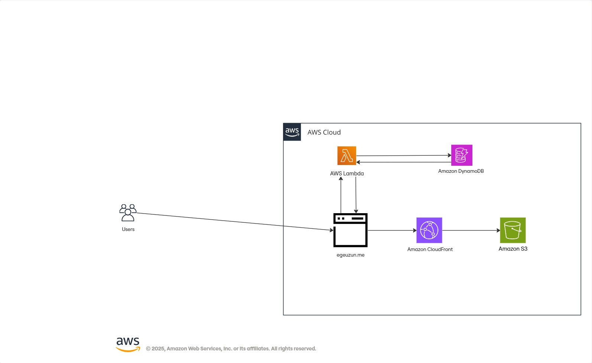

# AWS Cloud Resume Challenge
What is Cloud Resume Challenge? - [The Cloud Resume Challenge](https://cloudresumechallenge.dev/) is a multiple-step resume project which helps build and demonstrate skills fundamental to pursuing a career in Cloud.
## Architecture

**Services Used**:

- S3
- AWS CloudFront
- AWS Lambda
- Dynamo DB
- GitHub Actions
- Terraform
